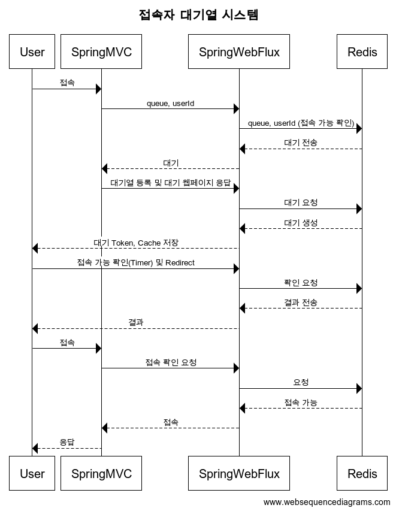

# 구현 목적
비동기 처리를 통한 앞단에서의 대용량 트래픽 처리를 경험할 수 있습니다.

# Visitor Queue Management System
이 프로젝트는 Redis, Reactor Stream, WebFlux를 사용하여 대량의 웹 접속을 효율적으로 관리하는 방문자 대기열 시스템을 구현한 Spring Boot 애플리케이션입니다.

# 주요 기능
- 비동기적, 논블로킹 요청 처리
- Redis 기반의 대기열 관리
- 실시간 대기열 상태 업데이트

